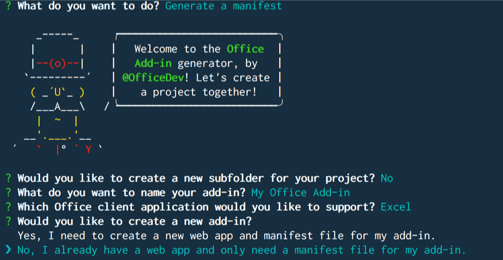
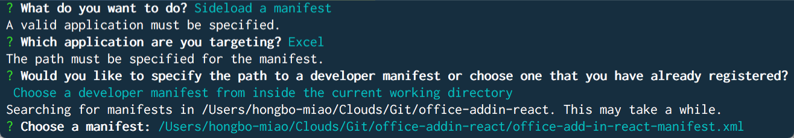
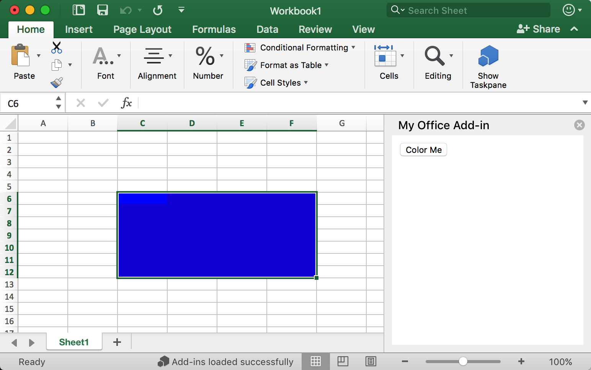

# Build an Add-in with React

### Step 1. Generate the React project by **Create React App**

If you never install [Create React App](https://github.com/facebookincubator/create-react-app) before, first install it globally.

```bash
npm install -g create-react-app
```

Then generate your React app by

```bash
create-react-app my-addin
```

### Step 2. Generate the manifest file by **Office Toolbox**

If you never installed [Office Toolbox](https://needupdate) before, first install it globally.

```bash
npm install -g office-toolbox
```

If you installed it before, go to your app folder.

```bash
cd my-addin
```

Generate the manifest file following the steps below.

```bash
office-toolbox
```



You should be able to see your manifest file with the name ends with **manifest.xml**.

Open it and replace all `https://localhost:3000` to `http://localhost:3000` in the generated manifest file.

### Step 3. Initialize

Open **public/index.html**, add

```html
<script src="https://appsforoffice.microsoft.com/lib/beta/hosted/office.debug.js"></script>
```

before `</head>` tag.

Open **src/index.js**, add `Office.initialize` out of `ReactDOM.render(<App />, document.getElementById('root'));` like below:

```javascript
const Office = window.Office;

Office.initialize = () => {
  ReactDOM.render(<App />, document.getElementById('root'));
};
```

### Step 4. Add "Color Me"

Open **src/App.js**. Replace by

```javascript
import React, { Component } from 'react';

// const Excel = window.Excel;

class App extends Component {
  constructor(props) {
    super(props);

    this.onColorMe = this.onColorMe.bind(this);
  }

  onColorMe() {
    window.Excel.run(async (context) => {
      const range = context.workbook.getSelectedRange();
      range.format.fill.color = 'green';
      await context.sync();
    });
  }

  render() {
    return (
      <button onClick={this.onColorMe}>Color Me</button>
    );
  }
}

export default App;
```

### Step 5. Run the app

Run the dev server through the terminal.

```bash
npm start
```

or

```bash
yarn start
```

### Step 6. Side load the manifest file by **Office Toolbox**

To run the add-in, you need side-load the add-in in the Excel.

Run this in terminal and following the steps below.

```bash
office-toolbox
```



It will open Excel. Click the 'Show Taskpane' button on the 'Home' tab to open your add-in.

Select the range and click **Color Me** button.



Congratulations you just finish your first React add-in for Excel!

